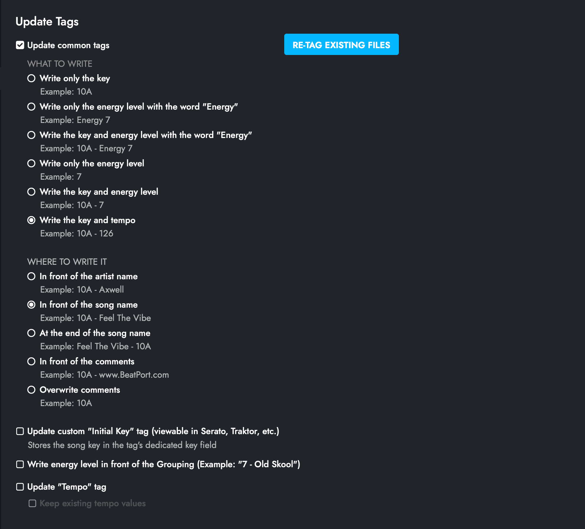

# Audio File Metadata Removal Tool

## Purpose
This tool prepares audio files for analysis by Mixed In Key by removing existing metadata tags. When audio files contain metadata (like ID3 tags in MP3s), Mixed In Key may not properly update the filename with the detected key and tempo information. This tool ensures consistent analysis by clearing these tags first.

## Step 1: Remove Metadata
1. Place `*Step1_RemoveMetadata.py` in a folder containing your audio files
2. Run the script to process all audio files in the directory and subdirectories
3. The script will:
   - Scan for supported audio files
   - Remove existing metadata tags
   - Preserve only basic file information
   - Prepare files for Mixed In Key analysis

## Step 2: Mixed In Key Analysis
For optimal results after metadata removal, configure Mixed In Key with these settings:

Key settings to note:
- Write the key and tempo (e.g., "10A - 126")
- Place notation in front of the song name
- Update common tags

## Step 3: Post-Processing
1. Place `*Step3_PostMIK_ReadMetaData.py` in the same folder as your audio files
2. Run the script to:
   - Verify all files have been properly analyzed
   - Add "All - " prefix to any files missing Camelot notation
   - Display a table showing:
     - Filename
     - Artist
     - Title
     - Key
     - Whether the file was renamed

## Supported Audio Formats
The tool handles metadata removal for various audio formats:
- MP3 (ID3 tags)
- M4A/MP4/AAC (iTunes metadata)
- FLAC (Vorbis comments)
- OGG/OPUS (Vorbis comments)
- AIFF/AIF (IFF chunks)
- WAV (limited metadata support)
- And more

## Technical Details
The script processes each audio file based on its format:

### MP3 Files
- Removes all ID3 tags
- Preserves only the original filename as the title
- Clears artist information

### M4A/MP4/AAC Files
- Removes iTunes-specific metadata
- Clears artwork, artist info, and other tags
- Maintains basic file information

### FLAC and OGG/OPUS Files
- Removes all Vorbis comments
- Keeps only essential file information
- Preserves audio quality while removing metadata

### AIFF/AIF Files
- Clears IFF chunk metadata
- Maintains audio data integrity
- Removes any embedded images or extra info

### WAV Files
- Limited metadata handling (WAV files typically have minimal metadata)
- Prepared for Mixed In Key's automatic processing

The script walks through all subdirectories in your folder, processing each supported audio file it finds. For each file, it:
1. Identifies the file format
2. Removes all existing metadata
3. Preserves only the original filename as the title
4. Saves the file with clean metadata
5. Prints confirmation of successful processing

## Requirements
- Python 3.x
- mutagen library (`pip install mutagen`)
- Mixed In Key software (for subsequent analysis)

## Usage